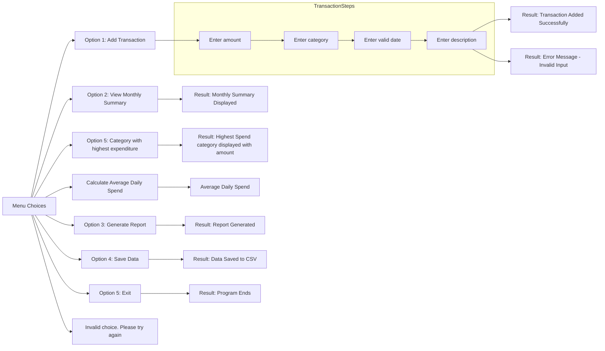
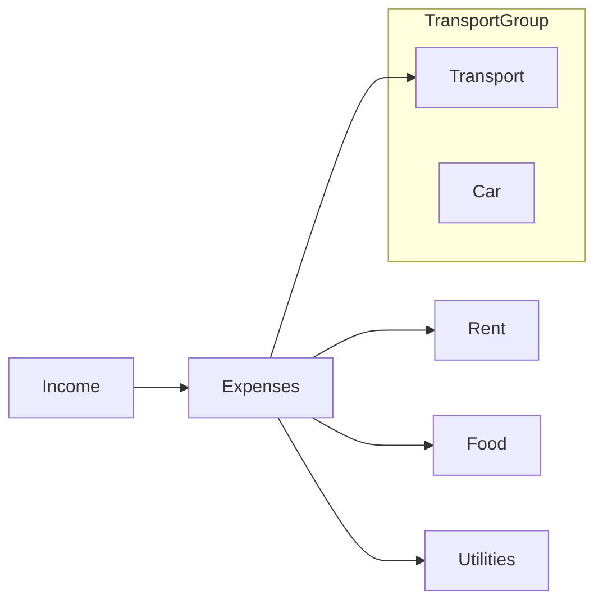
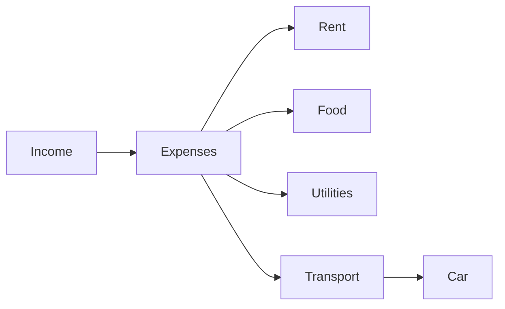

# CS50project Finance Tracker

## Figuring out what project to do

After some reading we considered doing a finance tracker which could 
- add transactions and reliably save to a csv file
- prepare a monthly summary of transactions
- give specifics such as the average of the money spent and 
the category which had the highest expenditure
- generate a graphical report

## Steps

### Creating classes
We utilized object oriented programming to set up two classes which we will use in the project

The first class we called Transaction with  attributes:
- amount
- category (type the transaction is attached to)
- date (on which the transaction was made)
- description (short of the transaction)

```python
class Transaction:
    def __init__(self, amount, category, date, description=""):
        self.amount = amount
        self.category = category
        self.date = date
        self.description = description
```

Them we set up the class FinanceTracker with several methods.  

```python
class FinanceTracker:
    def __init__(self, filename="finance_data.csv"):
        self.filename = filename
        self.transactions = []
```
- add transactions (which appends the file by adding transactions)
  
``` python
def add_transaction(self, transaction):
        self.transactions.append(transaction)
```

- save_to_file (which instructs python to create the csv file if there was none present and saves the information
  added)
  
```python
def save_to_file(self):
        with open(self.filename, "w", newline="") as file:
            writer = csv.writer(file)
            for t in self.transactions:
                writer.writerow([t.amount, t.category, t.date, t.description])
```

- load_from file (which opens the file and reads the data that is present in it). If no file has been created we use the exception FileNotFoundError with the statement that the "file was not found. Starting Fresh"

```python
def load_from_file(self):
        try:
            with open(self.filename, "r") as file:
                reader = csv.reader(file)
                for row in reader:
                    amount, category, date, description = row
                    self.transactions.append(Transaction(float(amount), category, date, description))
        except FileNotFoundError:
            print("No existing file found. Starting fresh.")
```

- generate report (which prepares a graph to represent the data.)
> [!IMPORTANT]
>```flowchart LR
>    If there are no transactions, it will state no transactions to report
>```

``` python
def generate_report(self):
        if not self.transactions:
            print("No transactions to report.")
            return
        df = pd.DataFrame([vars(t) for t in self.transactions])
        print(df.groupby("category")["amount"].sum())
        df.groupby("category")["amount"].sum().plot(kind="bar")
        plt.show()
```

- We then defined several standalone functions 
    - `def monthly_summary` - this function will caclulate the total amount of money spent for the month and will return that in a string statement telling how much money a person earned over the month and also give an alert if it went over that amount.


 ```python
def monthly_summary(self, month):
        total = 0
        for t in self.transactions:
            if t.date.startswith(month):  # e.g., "2026-09"
                total += t.amount
        if total > 100000:
            print("⚠️ Alert: You spent over $100,000 this month!")
        print(f"Total spent in {month}: ${total:.2f}")
```   

-   
    - `def_most_spent_category` - this function totals the amount spent in a month
    and identifies the category which carried the most expenditure. 

```python
def most_spent_category(transactions):
    if not transactions:
        print("No transactions available.")
        return
    df = pd.DataFrame([vars(t) for t in transactions])
    totals = df.groupby("category")["amount"].sum()
    max_category = totals.idxmax()
    max_value = totals.max()
    print(f"💰 Most spent on: {max_category} (${max_value:.2f})")
```  

-   
    - `def average_daily_spend` - this function gives the average daily spend for the month

```python
def average_daily_spend(transactions):
    if not transactions:
        print("No transactions available.")
        return
    df = pd.DataFrame([vars(t) for t in transactions])
    df["date"] = pd.to_datetime(df["date"])
    daily_totals = df.groupby(df["date"].dt.date)["amount"].sum()
    avg_spend = daily_totals.mean()
    print(f"📆 Average daily spend: ${avg_spend:.2f}")
```

-
    - `def validate_date` - this finction validates the date entered for activity on any transaction using regular expressions. We created a pattern for the date format and checked if it matched with the entry 'date_str'. We used conditional 'IF' and the exception 'Raise Valuerror' to indicate an error message if the input did not match the pattern. If it did match then we instructed the program to return 'data_str'. 

```python
def validate_date(date_str):
    pattern = r"^\d{4}-\d{2}-\d{2}$"
    if not re.match(pattern, date_str):
        raise ValueError("Date must be in YYYY-MM-DD format")
    return date_str
```

## Setting up of the main function 

This includes all we planned to do in the expense tracker program. In our `main()` function we create the object `tracker` from the class finance tracker. We then called its method `load_from_file()` to access existing information from the csv file. 

```python
def main():
    tracker = FinanceTracker()
    tracker.load_from_file()
```

We then instructed the program to print the different options for the expense tracker and prompt the user for a choice. 

``` python
while True:
    print("\n--- Personal Finance Tracker ---")
    print("1. Add Transaction")
    print("2. View Monthly Summary")
    print("3. Generate Report")
    print("4. Save Data")
    print("5. Exit")
    print("6. Most Spent Category")
    print("7. Average Daily Spend")

    choice = input("Choose an option: ")
```

We then use use conditional IF sentences to determine the result that will happen given the option chosen. 

```python
if choice == "1":
            try:
                while True:
                    try:
                        amount = float(input("Enter amount: "))
                        if amount < 0:
                            print("Amount cannot be negative. Please enter a valid amount.")
                            continue
                        break
                    except ValueError:
                        print("Invalid input. Please enter a numeric value for the amount.")

                category = input("Enter category (Food, Rent, etc.): ")
                date = validate_date(input("Enter date (YYYY-MM-DD): "))
                description = input("Enter description (optional): ")
                tracker.add_transaction(Transaction(amount, category, date, description))
                print("Transaction added successfully!")
            except Exception as e:
                print(f"An error occurred while adding the transaction: {e}")

        elif choice == "2":
            month = input("Enter month (YYYY-MM): ")
            monthly_summary(tracker.transactions, month)

        elif choice == "3":
            tracker.generate_report()

        elif choice == "4":
            tracker.save_to_file()
            print("Data saved successfully!")

        elif choice == "5":
            print("Goodbye!")
            break

        elif choice == "6":
            most_spent_category(tracker.transactions)

        elif choice == "7":
            average_daily_spend(tracker.transactions)

        else:
            print("Invalid choice. Please choose a number.")
```
This is represented in the following flowchart. 





[Can we have a link here](https://www.google.com/search?q=picture+of+a+dog&rlz=1C1CFYW_enJM1210JM1210&oq=picture+of+a+dog&gs_lcrp=EgZjaHJvbWUqBggAEEUYOzIGCAAQRRg7MgcIARAAGIAEMgcIAhAAGIAEMgcIAxAAGIAEMgcIBBAAGIAEMgcIBRAAGIAEMgcIBhAAGIAEMgcIBxAAGIAEMgcICBAAGIAEMgcICRAAGIAE0gEINDE2NWowajeoAgCwAgA&sourceid=chrome&source=chrome.ob&ie=UTF-8#sv=CAMSXhoyKhBlLWR4VEJsb01XQloweENNMg5keFRCbG9NV0JaMHhDTToOSlhSb2p1RVVxYklFWE0gBCokCg41ODNmcmdyZHE2aVlGTRIQZS1keFRCbG9NV0JaMHhDTRgAMAEYByCBlczqCEoIEAEYASABKAE)


This is being done *in a crazy* way to **TEST**


## Expense Tracker
This section shows a sample record of expenses stored in table format.


| 🟦 Category | 🟦 Details | 🟦 Status |
| --- | --- | --- |
| rent| 50 | 2026-09-14 |
> 💡 Tip: You can add more rows for additional expenses.

## Sample of Expense Flowchart




Below we have some blocked text
> This text is indented 

## Sample 2 of Expense Flowchart



> [!NOTE]
> This is a general note.

> [!TIP]
> 💡 Helpful hint goes here.

> [!IMPORTANT]
> ⚠️ Critical instruction you must follow.

> [!WARNING]
> 🚨 Be careful — this could cause issues.

A polished README often mixes tables, flowcharts, and callouts. For example, you could put your expense table, then add a [!IMPORTANT]

>```
>    I love the work I am doing
>```


In this script we have some `Variable` and `string` values

If we want to bold and underline we can use this
## Trust the Process

In this script we have some `Variable` and `string` values


- first time

links for videos to learn from include

[learning github](https://www.youtube.com/watch?v=eJojC3lSkwg)

[making a gihub rpository](https://www.youtube.com/watch?v=qNKdm8qAQfg) 

